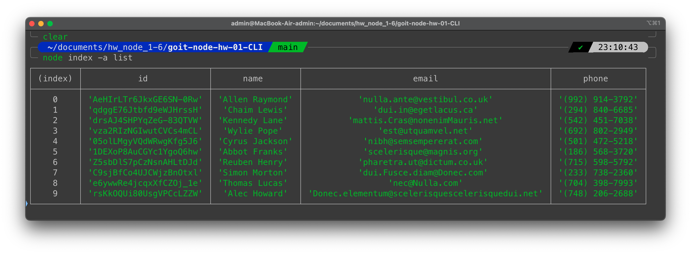
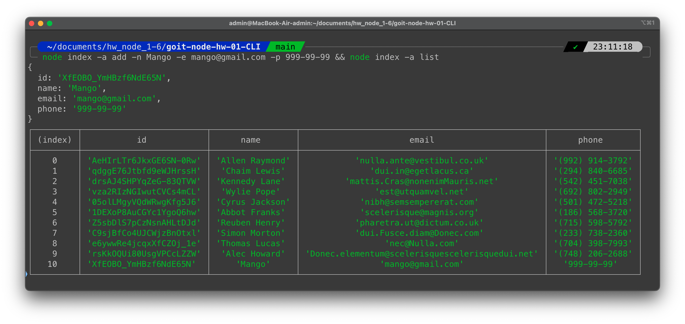

# Отримуємо і виводимо весь список контактів у вигляді таблиці (console.table)

```bash
node index -a list
```



# Отримуємо контакт по id і виводимо у консоль об'єкт контакту або null, якщо контакту з таким id не існує.

```bash
node index -a get -i 05olLMgyVQdWRwgKfg5J6
```

```bash
node index -a get -i non-existent-ID
```


# Додаємо контакт та виводимо в консоль об'єкт новоствореного контакту

```bash
node index -a add -n Mango -e mango@gmail.com -p 322-22-22 && node index -a list
```



# Обновляє контакт та виводимо в консоль масив з обєктами, до оновлення і після або null, якщо контакту з таким id не існує.

```bash
node index -a update -i qdggE76Jtbfd9eWJHrssH -n update -e update@gmail.com -p 322-22-22 && node index -a list
```

```bash
node index -a update -i non-existent-ID -n update -e update@gmail.com -p 322-22-22
```


# Видаляємо контакт та виводимо в консоль об'єкт видаленого контакту або null, якщо контакту з таким id не існує.

```bash
node index -a remove -i qdggE76Jtbfd9eWJHrssH && node index -a list
```

```bash
node index -a remove -i non-existent-ID
```


node index -a list
node index -a get -i 05olLMgyVQdWRwgKfg5J6
node index -a get -i non-existent-ID
node index -a add -n Mango -e mango@gmail.com -p 322-22-22 && node index -a list
node index -a update -i qdggE76Jtbfd9eWJHrssH -n update -e update@gmail.com -p 322-22-22 && node index -a list
node index -a update -i non-existent-ID -n update -e update@gmail.com -p 322-22-22 && node index -a list
node index -a remove -i qdggE76Jtbfd9eWJHrssH && node index -a list
node index -a remove -i non-existent-ID && node index -a list
